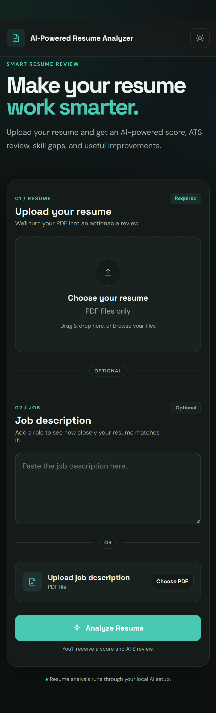

# AI-Powered Resume Analyzer

An AI-powered web application that analyzes resumes using a locally hosted **Qwen3 1.7B** model through **Ollama**. Users can upload a resume PDF and optionally provide a job description to receive structured resume feedback and job-match analysis.

---

## Features

### Resume Analysis
- Upload a resume in PDF format
- Extract text from PDF using PyMuPDF
- Clean extracted resume text
- Detect common resume sections
- Generate an AI-based resume score from 0–100
- Assess ATS compatibility
- Identify strengths and weaknesses
- Identify missing skills
- Identify relevant ATS keywords
- Generate practical improvement suggestions

### Job Description Matching
A job description can be provided in either of two ways:
- Paste the job description as text
- Upload the job description as a PDF

When a job description is supplied, the system also provides:
- Job match score
- Matching skills
- Missing job skills
- Relevant ATS keywords
- Job-specific suggestions

### System
- React frontend
- FastAPI backend
- Local Ollama + Qwen3 1.7B
- Dockerized frontend and backend
- REST API communication
- Input validation and error handling
- No database or permanent storage of uploaded resumes

---

## System Architecture

```
User
  |
  v
React Frontend
  |
  | HTTP / REST
  v
FastAPI Backend
  |
  v
PDF Text Extraction (PyMuPDF)
  |
  v
Resume / JD Text
  |
  v
Ollama
  |
  v
Qwen3:1.7B
  |
  v
Structured JSON
  |
  v
FastAPI
  |
  v
React Results UI
```

### Docker Architecture

```
Windows Host
  |
  ├── Ollama
  |     └── Qwen3:1.7B
  |
  └── Docker Desktop
        ├── Frontend Container :5173
        └── Backend Container :8000
```

Ollama runs on the host machine. The backend Docker container reaches the host Ollama service through `host.docker.internal`.

---

## Application Workflow

### Resume-only analysis
1. The user selects a resume PDF in the React frontend.
2. React stores the selected file.
3. The frontend sends the PDF as `multipart/form-data` to `POST /resume/upload`.
4. FastAPI receives the uploaded file.
5. PyMuPDF extracts text from the PDF.
6. The backend cleans the extracted text and detects common sections.
7. The extracted text is sent to Qwen3 1.7B through Ollama.
8. Ollama returns structured JSON.
9. FastAPI sends the analysis back to React.
10. React displays the score, ATS compatibility, strengths, weaknesses, missing skills, keywords, and suggestions.

### Resume + Job Description
1. The user uploads a resume PDF.
2. The user either pastes a job description or uploads a JD PDF.
3. React sends the resume and JD to `POST /resume/match`.
4. FastAPI extracts the resume and JD text.
5. Both are sent to Qwen3 1.7B through Ollama in one analysis request.
6. The model returns overall resume analysis and job-match analysis.
7. React displays the resume score, match score, matching skills, missing skills, ATS keywords, and suggestions.

---

## Technologies Used

| Layer | Technology |
|---|---|
| Frontend | React, JavaScript, HTML, CSS |
| Build Tool | Vite |
| Backend | Python, FastAPI |
| PDF Processing | PyMuPDF |
| AI | Ollama, Qwen3:1.7B |
| API | REST / HTTP |
| Testing | Pytest |
| Containerization | Docker, Docker Compose |

---

## Project Structure

```
ai-resume-analyzer/
│
├── backend/
│   ├── app/
│   │   ├── main.py
│   │   ├── routes/
│   │   │   ├── health.py
│   │   │   └── resume.py
│   │   └── services/
│   │       ├── ollama_service.py
│   │       └── resume_parser.py
│   │
│   ├── tests/
│   │   ├── test_health.py
│   │   ├── test_ollama_service.py
│   │   ├── test_resume_parser.py
│   │   └── test_resume_routes.py
│   │
│   ├── requirements.txt
│   └── Dockerfile
│
├── frontend/
│   ├── src/
│   │   ├── App.jsx
│   │   ├── App.css
│   │   ├── main.jsx
│   │   └── index.css
│   ├── package.json
│   ├── package-lock.json
│   ├── vite.config.js
│   └── Dockerfile
│
├── docker-compose.yml
├── README.md
└── .gitignore
```

---

## Main Components

**`frontend/src/App.jsx`**
Handles:
- Resume PDF selection
- Job description text/PDF input
- Frontend validation
- API requests
- Loading state
- Error messages
- Displaying analysis results

**`backend/app/main.py`**
Creates the FastAPI application, configures CORS, and registers the API routers.

**`backend/app/routes/health.py`**
Provides the backend health endpoint: `GET /health`

**`backend/app/routes/resume.py`**
Controls the resume-processing API flow:
- Validates uploaded files
- Reads PDF bytes
- Extracts text
- Calls the AI service
- Returns structured results
- Handles API errors

**`backend/app/services/resume_parser.py`**
Contains text-processing functions:
- `clean_resume_text()`
- `extract_sections()`

**`backend/app/services/ollama_service.py`**
Handles communication with the locally hosted Ollama API and requests structured JSON from Qwen3 1.7B.

---

## API Endpoints

### `GET /health`
Checks whether the backend is running.

Example response:
```json
{
  "status": "ok"
}
```

### `POST /resume/upload`
Performs resume-only analysis.

Form field:
- `file` = resume PDF

Returns:
- Filename
- Content type
- Extracted text
- Detected sections
- AI analysis

### `POST /resume/match`
Compares a resume against a job description.

Form fields:
- `file` = resume PDF
- `job_description` = optional pasted JD text
- `job_file` = optional JD PDF

The job description must be supplied either as text or as a PDF.

Returns:
- Resume analysis
- Resume score
- ATS compatibility
- Strengths
- Weaknesses
- Missing skills
- ATS keywords
- Suggestions
- Job match score
- Matching skills
- Job-specific missing skills
- Job-specific ATS keywords
- Job-specific suggestions

---

## AI Output

**Resume Analysis**
```json
{
  "score": 0,
  "ats_compatibility": "Needs Improvement",
  "strengths": [],
  "weaknesses": [],
  "missing_skills": [],
  "ats_keywords": [],
  "suggestions": []
}
```

**Job Match**
```json
{
  "match_score": 0,
  "matching_skills": [],
  "missing_skills": [],
  "ats_keywords": [],
  "suggestions": []
}
```

> The scores are AI-generated assessments based on the supplied resume and, when applicable, the job description. They are not official scores from a commercial ATS platform.

---

## Prerequisites

Install:
- Python 3.10+
- Node.js
- Ollama
- Docker Desktop

Pull the required model:
```bash
ollama pull qwen3:1.7b
```

Make sure Ollama is running before performing an analysis.

---

## Run with Docker

From the project root:
```bash
docker compose up --build
```

Open the application: `http://localhost:5173`

Backend: `http://127.0.0.1:8000`

Health check: `http://127.0.0.1:8000/health`

To stop the containers:
```bash
docker compose down
```

---

## Run Without Docker

**Backend** — from the `backend` directory:
```bash
python -m pip install -r requirements.txt
python -m uvicorn app.main:app --reload
```
Backend: `http://127.0.0.1:8000`

**Frontend** — from the `frontend` directory:
```bash
npm install
npm run dev
```
Frontend: `http://localhost:5173`

---

## Testing

The backend contains automated tests covering:
- Health endpoint
- Resume text cleaning
- Resume section extraction
- Resume upload
- Multi-page PDF handling
- Invalid file types
- Empty files
- Invalid/empty job descriptions
- Job description PDF handling
- Resume + JD matching
- Ollama success handling
- Ollama connection/error handling
- Invalid AI response handling

Run the tests from the `backend` directory:
```bash
python -m pytest -q
```

---

## Error Handling

The backend uses HTTP status codes for common failures:

| Status | Meaning |
|---|---|
| 200 | Successful request |
| 400 | Invalid input, file, or PDF |
| 502 | Invalid AI response |
| 503 | Ollama unavailable |
| 500 | Unexpected server-side error |

The frontend converts these failures into user-friendly messages.

---

## Screenshots

**Home Page**



**Resume Analysis**


Folder:
```
frontend/
└── screenshots/
    ├── homepage.png
    └── resumeanalysis1.png
```

---

## Assumptions and Limitations

- The application currently accepts PDF files only.
- Text-based PDFs work best with the current PDF extraction approach.
- Image-only/scanned PDFs may not produce useful text without OCR.
- AI analysis depends on the locally installed Ollama service and Qwen3 1.7B model.
- Resume and match scores are AI-generated assessments, not official ATS scores.
- Analysis quality depends on the information contained in the supplied resume and job description.
- Uploaded documents are not permanently stored in a database.
- The current implementation is intended for local use and demonstration.
- Ollama must be running on the host machine when the backend is running in Docker.

---

## Privacy

Resume and job-description files are processed locally by the application. The current implementation does not store uploaded documents in a database.

---

## Future Improvements

- OCR support for scanned resumes
- More deterministic ATS scoring
- More advanced keyword extraction
- Resume recommendations across multiple job descriptions
- User accounts and saved analyses
- Exportable analysis reports
- Production frontend serving
- Support for additional document formats

---

## Demo Flow

For a short project demonstration:
1. Start Ollama and ensure `qwen3:1.7b` is available.
2. Start the application with Docker Compose.
3. Open `http://localhost:5173`.
4. Upload a resume PDF.
5. Run resume-only analysis.
6. Show the resume score, ATS compatibility, strengths, weaknesses, keywords, and suggestions.
7. Return to the upload screen.
8. Paste or upload a job description.
9. Run job matching.
10. Show the match score, matching skills, missing skills, ATS keywords, and suggestions.
11. Briefly explain the flow: **User → React → FastAPI → PyMuPDF → Ollama / Qwen3:1.7B → JSON → React Results**